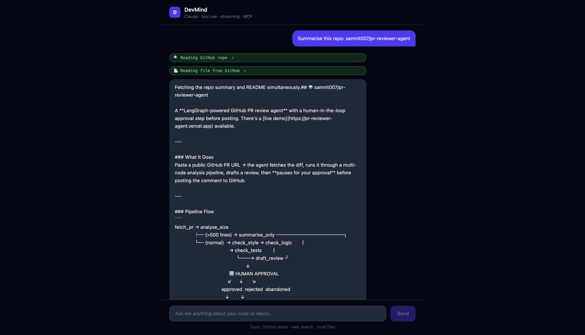
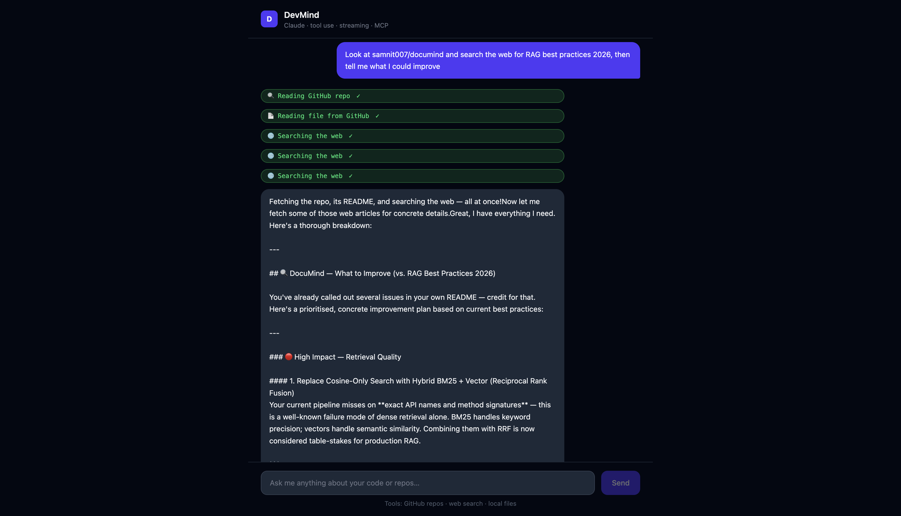

# DevMind

> An AI dev assistant that can read your GitHub repos, search the web, and reason about your code — with answers streaming back word by word in real time.

**Live demo:** https://devmind-mu.vercel.app

## What it does

Ask DevMind anything about your code or repos. It decides which tools to use, calls them, and streams the answer back as it generates.

**Example prompts:**
- `Summarise this repo: samnit007/pr-reviewer-agent`
- `Read the README of samnit007/documind and suggest improvements`
- `Search the web for LangGraph best practices 2026`
- `Look at samnit007/devmind and tell me what tests are missing`

## Screenshots

### Streaming response with tool call badges


### Multi-tool reasoning


## Architecture

```
React UI (Vite + Tailwind)
      │
      │  POST /api/chat  (SSE stream)
      ▼
FastAPI backend
      │
      ├── Claude API (tool_use + streaming)
      │         │
      │    decides which tools to call
      │         │
      ├── GitHub tool   →  PyGithub → GitHub API
      ├── Web search    →  Tavily API
      └── File reader   →  local filesystem (sandboxed)

MCP Server (stdio transport)
  └── same tools exposed via Model Context Protocol
      → connect via Claude Desktop or MCP Inspector
```

## Key technical details

**Claude tool use + streaming together**
Claude's streaming API and tool use API work differently — streaming delivers text deltas, tool use interrupts the stream for function calls, then resumes. This backend handles both in a single agentic loop: stream text → detect tool call → execute tool → inject result → continue streaming.

**MCP server**
`backend/mcp_server.py` exposes the same four tools via the official `mcp` Python SDK over stdio transport. Connect it to Claude Desktop by adding to your `claude_desktop_config.json`:
```json
{
  "mcpServers": {
    "devmind": {
      "command": "python",
      "args": ["/path/to/devmind/backend/mcp_server.py"]
    }
  }
}
```

**Real-time SSE streaming**
The backend yields `text/event-stream` chunks as Claude generates them. The React frontend reads the stream with the Web Streams API and appends each delta to the message in state — no polling, no waiting for the full response.

**Tool call badges**
The frontend shows amber "in progress" badges when a tool is called and green "done" badges when it completes — before the answer text appears. This makes the agent's reasoning visible rather than hiding it behind a spinner.

## Stack

| Layer | Choice |
|---|---|
| Frontend | React 19 + TypeScript + Tailwind CSS v4 |
| Backend | Python + FastAPI |
| AI | Claude Sonnet (tool use + streaming) |
| Tools | PyGithub, Tavily search, local file reader |
| MCP | Official `mcp` Python SDK (stdio transport) |
| Deploy | Railway (backend) + Vercel (frontend) |

## Run locally

### Backend

```bash
cd backend
python3.11 -m venv venv && source venv/bin/activate
pip install -r requirements.txt
cp .env.example .env   # fill in keys
uvicorn app.main:app --reload --port 8000
```

### Frontend

```bash
cd frontend
npm install
npm run dev   # http://localhost:5175
```

### MCP server (optional)

```bash
cd backend
source venv/bin/activate
python mcp_server.py
```

Connect via [MCP Inspector](https://github.com/modelcontextprotocol/inspector) or Claude Desktop.

## Environment variables

| Variable | Required | Description |
|---|---|---|
| `ANTHROPIC_API_KEY` | Yes | Anthropic API key |
| `GITHUB_TOKEN` | Yes | GitHub PAT (read access) |
| `TAVILY_API_KEY` | Yes | Tavily search API key (free tier) |
| `CLAUDE_MODEL` | No | Defaults to `claude-sonnet-4-6` |
| `FILES_ROOT` | No | Sandbox root for local file reads (defaults to `~`) |

## What I'd add next

- **Conversation memory** — persist chat history across sessions (currently stateless per request)
- **Code execution tool** — run Python snippets in a sandbox and return output
- **Streaming to MCP** — MCP server currently returns full responses; streaming over SSE transport would improve latency
- **Auth** — right now anyone with the URL uses your GitHub token and Tavily credits
